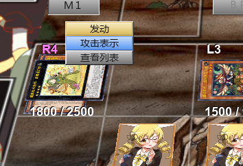
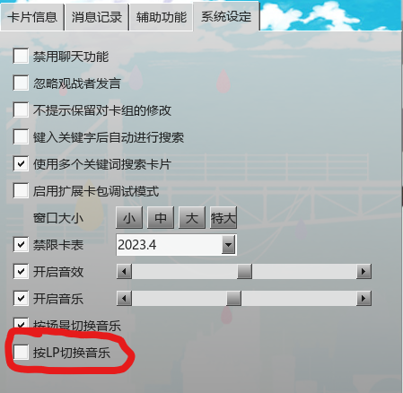

## YGOPro-Rumia

A script engine for "yu-gi-oh!" and sample gui

With some additional features! (Modified by Rumia <rumia-san@outlook.com> )

[中文说明](https://github.com/Fluorohydride/ygopro/wiki/%E4%B8%AD%E6%96%87%E8%AF%B4%E6%98%8E)

### Rumia added features

#### Search card name and card set when constructing deck
Now we could search the card name when constructing the deck!
It would be more convenient to search related cards since we don't need to type the name manually.

#### Colored buttons
Buttons like "activate", "attack", etc. has been colored

#### New settings
Don't change music if LP goes done

### Keys:
* ESC: Minimize the window.
* A: Holding down this button will let the system stop at every timing.
* S: Holding down this button will let the system skip every timing.
* D: Holding down this button will let the system stop at available timing.
* R: Fix the font glitch.
* F1~F4: Show the cards in your grave, banished zone, extra deck, xyz materials.
* F5~F8: Show the cards in your opponent's grave, banished zone, extra deck, xyz materials.

### Color in card list:
#### Background: 
* White = your card, Grey = your opponent's card  

#### Text: 
Cards in deck, extra deck and banished zone: 
* Black = face-up, Blue = face-down

Xyz materials:
* Black = default, Blue = the owner of the xyz material is different from its controller

### Sequence:
* Monster Zone: 1~5, starting from the left hand side.
* Spell & Trap Zone: 1~5, starting from the left hand side.
* Field Zone: 6
* Pendulum Zone: 0~1, starting from the left hand side.
* The others: 1~n, starting from the bottom.

### Deck edit page:
* All numeric textboxs: They support >, =, <, >=, <= signs.
* Card name: Search card names and texts by default, $foo will only search foo in card names, and @foo will search cards of "foo" archetype(due to translation, card name contains "foo" does not mean that card is "foo" card).

### Command-line options:
* `-e foo.cdb`: Load foo.cdb as the extra database.
* `-n nickname`: Set the nickname.
* `-h 192.168.0.2`: Set the host to join in LAN mode.
* `-p 7911`: Set the port to join in LAN mode.
* `-w abc`: Set the password to join in LAN mode.
* `-d`: Enter the deck edit page.
* `-d deck`: If used along with `-j` it mean select the deck, or it will open the deck to edit.
* `-c`: Create host with default settings.
* `-j`: Join the host specified in above, or if absent, lasthost in system.conf file.
* `-r`: Enter the replay mode page.
* `-r replay.yrp`: Load the replay.yrp in replay mode.
* `-s`: Enter the single mode page.
* `-s puzzle.lua`: Load the puzzle.lua in single mode.
* `-k`: Keep when duel finished. See below.

#### Note:
* `-c` `-j` `-e` `-r` `-s` shoule be the last parameter, because any parameters after it will get ignored.
* `-d` `-c` `-j` `-e` `-r` `-s` will make YGOPro automatically exit when the duel or deck editing is finished. This is useful for some launchers. If you want to keep it, add `-k` before them.
* `-d` `-r` `-s` support full path of file, or just filename. But remember deck filename should NOT have extension when replay and single filename MUST have extension.

### Directories:
* pics: .jpg card images(177*254).
* pics\thumbnail: .jpg thumbnail images(44*64).
* script: .lua script files.
* textures: Other image files.
* deck: .ydk deck files.
* replay: .yrp replay files.
* expansions: *.cdb will be loaded as extra databases.
